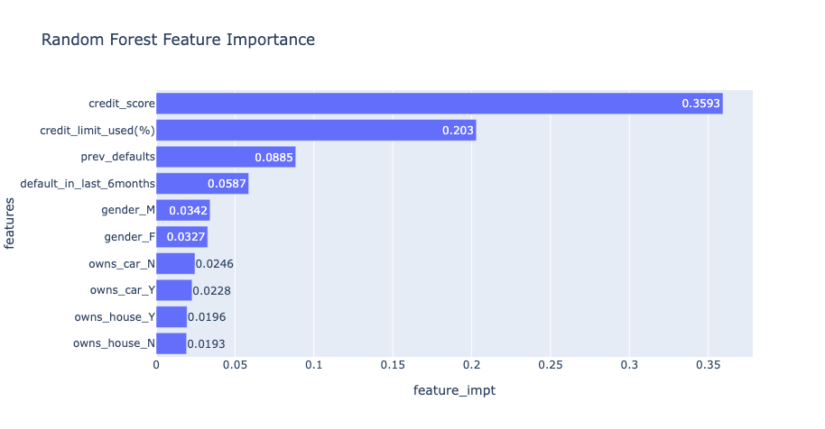
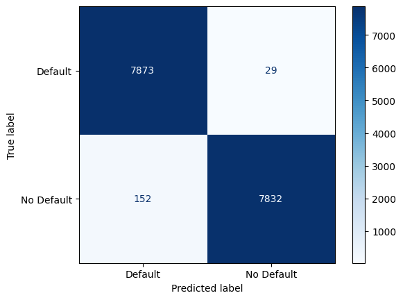
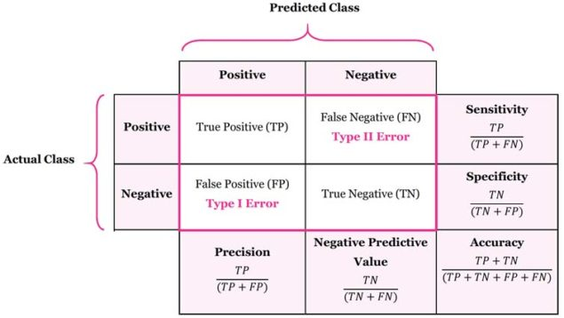
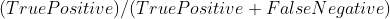
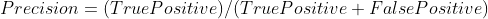

# Credit Card Default Classification and App

## Introduction
This is a credit card default detection system uses machine learning algorithm called a Random Forest Classifier to detect which customers are at risk of defaulting on their credit card payments. This can help credit card companies to identify customers who may need additional support or who may be at higher risk of defaulting, so that they can take appropriate action to mitigate the risk.

## Executive sumary
We are using a prediction model called the Random Forest classifier to forecast whether a credit card holder is likely to default on their payments. The Random Forest classifier is a popular machine learning algorithm that uses multiple decision trees to make predictions. It is known for its ability to handle large datasets and to generate accurate and robust predictions. This model has a recall score of 0.98, which means that it is able to accurately identify a large proportion of credit card defaults in our dataset.

### **Feature Importance**
In a Random Forest Classifier, feature importance refers to the relative importance of each feature in predicting the target variable. The Random Forest algorithm assigns a score to each feature, indicating its importance in the model's prediction. Features with a higher score are considered more important than those with a lower score.

The model's top three features in terms of importance are: credit score, credit limit used, and previous defaults as shown on the graph below.

 
### **Confusion Matrix**
A confusion matrix is a table that is used to evaluate the performance of a classification model. It is also often used to calculate evaluation metrics such as accuracy, precision, and recall, which can help you understand the performance of the model and identify areas where it may be performing poorly.



### **Intrepret Confusion Matrix**



### **Recall**
Recall is defined as the number of true positive predictions made by the model divided by the total number of positive cases in the dataset.

 

In this case, the recall would be calculated as follows:

**Recall** =  7873 / (7873 + 29)
= 0.996

This means that the model has a recall of 99.6%, indicating that it was able to correctly identify almost all of the positive cases in the dataset.

### **Using Recall to evaluate the model**
A high recall score indicates that the model is able to identify a large proportion of the customers who are actually at risk of defaulting, while a low recall score means that the model is less effective at identifying these customers. In general, it is desirable to have a high recall score because it means that the model is able to identify most of the customers who are at risk of defaulting.

### **Precision**
Precision is defined as the number of true positive predictions made by the model divided by the total number of positive predictions made by the model.

 

In this case, the precision would be calculated as follows:

Precision = 7873 / (7873 + 152) = 0.980

This means that the model has a precision of 98.0%, indicating that out of all the predictions it made for the positive class, 98.0% of them were correct.


<br>

## **Streamlit Web Application**

The credit card default model is deployed on Streamlit.

Access to the Streamlit web application can be obtained using the provided link. Click on the link to open the application and begin using it.

---


## Project Folders Organization

```txt
├── README.md          <- The top-level README for developers using this project.
|
├── dataset            <- Data from third party sources.
|
├── app                <- Streamlit App.
│
├── models             <- Trained and serialized models.
│
├── notebooks          <- Jupyter notebooks.
│                                             
├── img                <- Images.
│
└── requirements.txt   <- The requirements file for reproducing the analysis environment.
                          
```

## Roadmap
 - Improve machine learning model using hyperparameter tuning.
 - Experiment with different machine learning models.
 - Create data pipelines to automate the data transform.


--------

